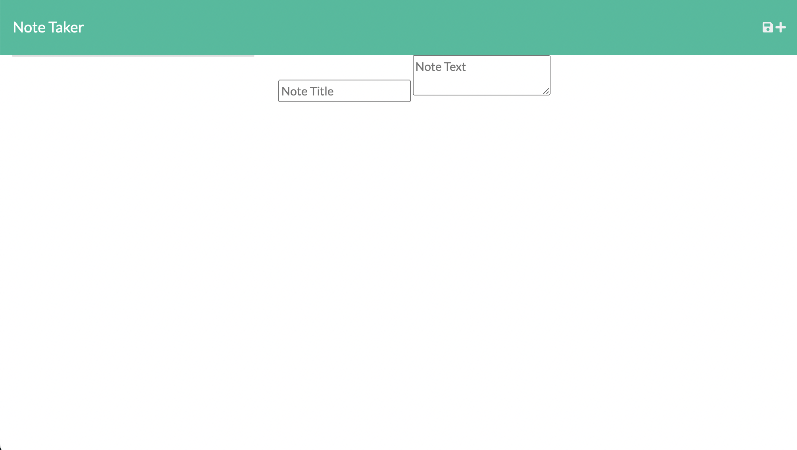

# Note-Taker
## Description
Note Taker Application Using Express.js and MongoDB Back End

## Deployed Website
[Deployed Version Here]()

## Table of Contents
- [Description](#description)
- [Deployed Website](#deployed-website)
- [Usage](#usage)
- [Installation](#installation)
- [Tests](#tests)
- [License](#license)
- [Contact Me](#contact-me)

## Usage

## Installation
1. Clone Repository
2. Install Dependencies

## Tests
N/A

## License
[MIT License](https://opensource.org/license/mit/)

Copyright © 2023 Benjamin Jacquez

## Contact Me
If you have ideas to contribute or questions to ask you can contact me here:
- [Github](https://github.com/Ben-Jacquez)
- Email: benjacquez.dev@gmail.com